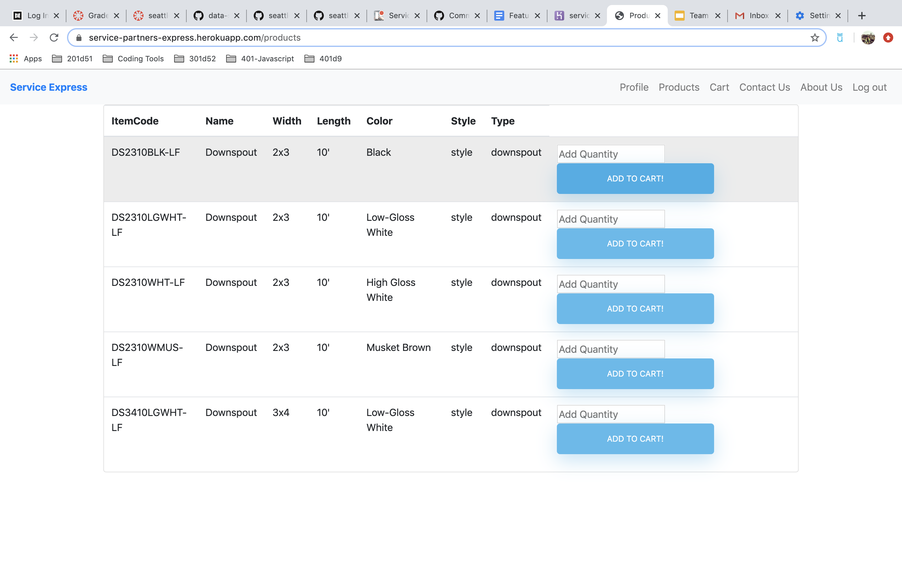
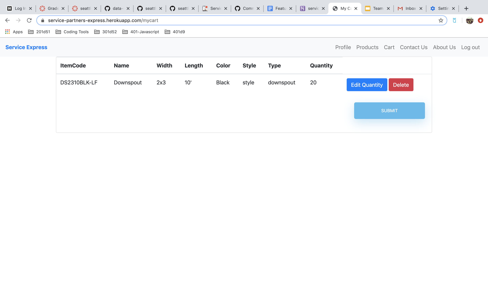
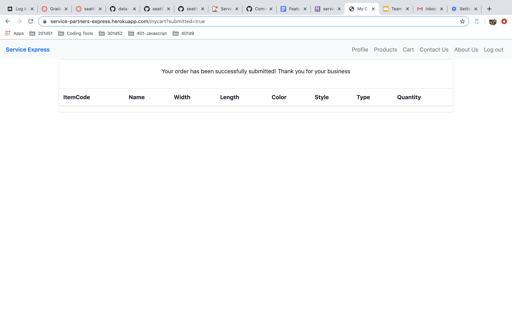

# Service-Partners-Order-Online

## Team Float: Ellen, Hai, Rachael, Shingo

Overview: This web application is a prototype online store for the customers of Service Partners branch 2007. Users will have to ability to select items and quantities, add them to a cart, delete or edit items from that cart and submit their order. Once an order is submitted it will be emailed as an excel attachment to the branch 2007 sales team.

[Visit the Deployed Site Here!](https://service-partners-express.herokuapp.com/)

#### Project Pitch: [Click Here](https://docs.google.com/document/d/1YybsAaAyw-0DSdFZIQa836C8rAtLPWxf9jNxDjD0XdI/edit)
#### Feature Ideas: [Click Here](https://docs.google.com/document/d/1usTgP-EIFnJVzO-sZFlOkzxSCus_oPFbOm1lqI1JkBE/edit?usp=sharing)
#### Communication Agreement: [Click Here](https://docs.google.com/document/d/1UCbBnhNDKBHi3setIF5jUazahVgzSWuCw-hhCAPljsg/edit?usp=sharing)
------------------------------------------------------------------------------------------------------------------------------

## Getting Up and Running

1. Clone the repo onto your local machine using the ```git clone``` command
2. Create a database on your machine called 'spordering'
3. FOR WINDOWS USERS: Update the application.properties file to include your username and password for the database
4. Start the server with the ```./gradlew bootRun``` command
5. In your browser visit localhost:8080 to see the running application

Integration testing
1. Set env variables in intellij in order for the tests to run because it wouldn't recognize the application context if its not there


------------------------------------------------------------------------------------------------------------------------------

### Technologies Used:
  - [Spring MVC](https://docs.spring.io/spring/docs/current/spring-framework-reference/web.html)
  - [Heroku](https://devcenter.heroku.com/categories/reference)
  - [Apache POI](https://poi.apache.org/)
  - [Bootstrap](https://getbootstrap.com/)
  - [Jquery](https://jquery.com/)
  - [Java](https://www.java.com/en/)
  - [Gradle](https://gradle.org/)
  - [Thymeleaf](https://www.thymeleaf.org/doc/tutorials/2.1/usingthymeleaf.html)

------------------------------------------------------------------------------------------------------------------------------

### The Running Application









------------------------------------------------------------------------------------------------------------------------------

### User Stories
 
 - As a customer, I want to be able to create an account on the ordering site, so I can place orders.
 - As store owner, I want only customers who currently have an account at my store to be able to create a new account, so that only verified customers can order from me.
 - As a customer I want to be able to log in and log out of this site, so that my information is secure.
 - As a customer, I would like to be able to add items to a cart, so that I can keep track of all the materials I am ordering.
 - As a sales rep, I want customers to order items only in specific multiples, so that a customer cannot order 25 feet of 10 foot downspout.
 - As a customer, I want to be able to edit the items in my cart, so that I can increase or decrease my order before I submit it.
 - As a customer, I want to be able to delete items from my cart, so that I am not stuck with materials I do not (or no longer) need.
 - As a customer, I want to be able to checkout once I have finished with my order, so that my order can be ready at the store when I arrive.
 - As a customer, I want to be able to review my order before it is finalized, so that I can make last minute changes or spot errors.
 - As a sales rep, when a customer orders on the site I want to receive and emailed version of their order, so that I can enter the order for pick up.
 - As a sales rep, I only want to see the customer id, the item codes and quantities, so that I can enter the order more quickly.
 - As a customer, I want to know about the company I am ordering from, so that I know they are a trust-worthy supplier.
 

------------------------------------------------------------------------------------------------------------------------------

### About the Team!

See more of Ellen's work [Here](https://github.com/egconley)

See more of Hai's work [Here](https://github.com/haitle16)

See more of Rachael's work [Here](https://github.com/Rachnicrice)

See more of Shingo's work [Here](https://github.com/shingoed)
